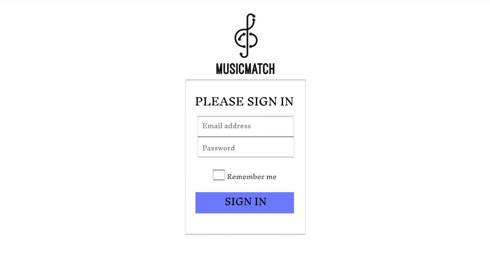
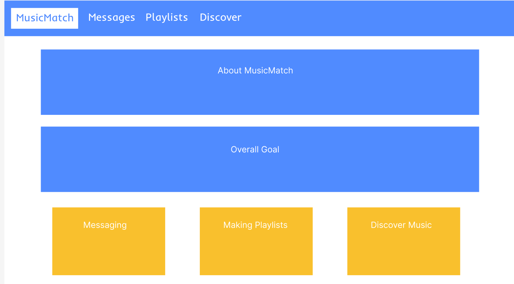
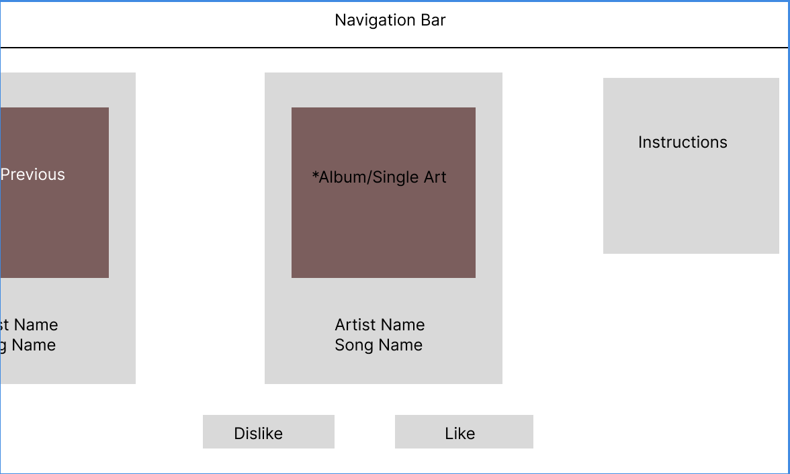
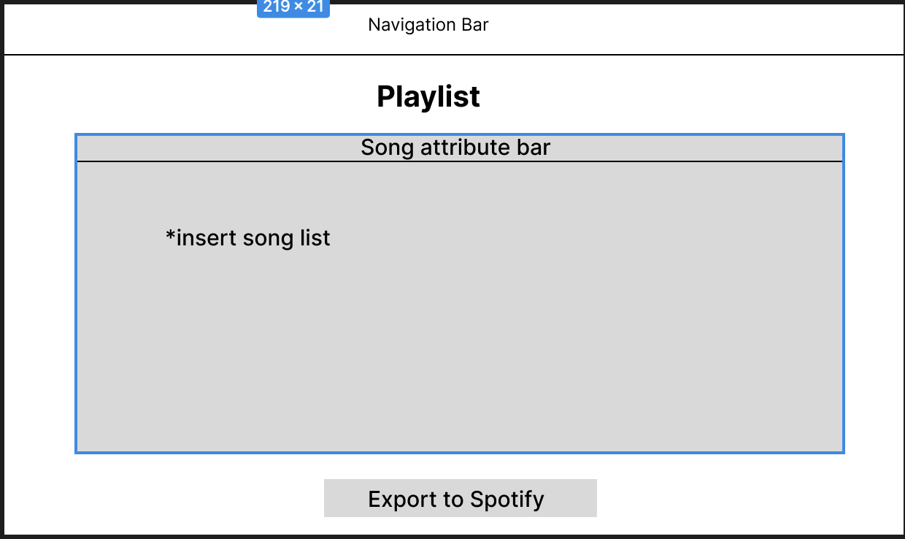
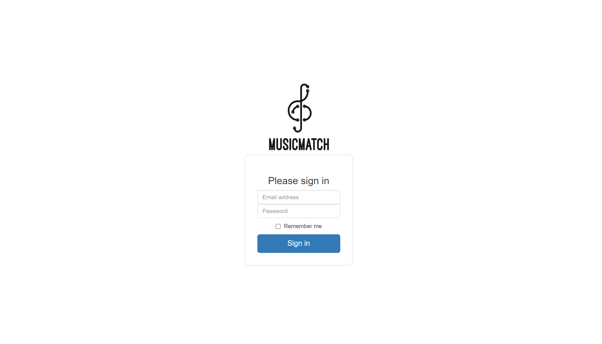
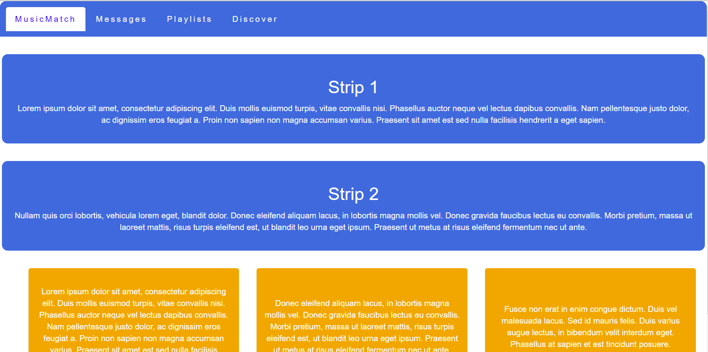
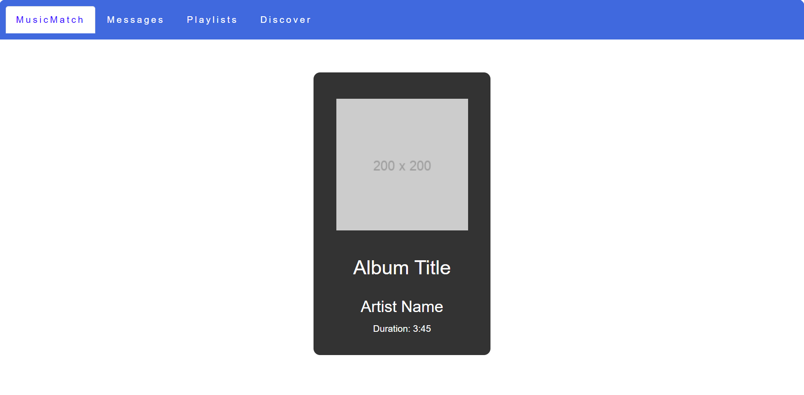

# UI Design

## Wireframe

For our web application, we have 5 total wireframe designs in mind to create: The login page, home page, playlist page, analysis page, and texting page. 

Login Page: 

The first wireframe design created represents the login page for a user. Upon accessing our web app, they see a logo of our product and  are given the instruction to login using their associated email address and password. Users are also given the option to have the web app  remember their login details so that they do not need to enter them again in the future. Once they fill out the information, they can click the "sign in" button to lead them to the next part of the application. 

Home Page: 

The home page wireframe is what the user sees upon signing in on the login page. Aside from the navigation bar, the page does not have any forms of interaction for the user. Instead, this page serves as an informational piece to tell the user what the application is and what features are included. There are two pieces of text that represent what our product is and what the overall goal is. At the bottom, there are 3 pieces of text that explain each feature of the application is meant to do. Overall, this page will help our users interact with our application better and make it easier to navigate as a whole.  

Analysis Page:

This design depicts what the analysis page looks like from a user perspective. They are able to choose whether they like a song or not and thus can help us analyze their taste in music and help suggest similar songs. This page consists of two buttons the user can interact with: the dislike and like button. This interface makes it simple for a user to understand what to do, and also includes instructions on the side in case there is any confusion. Clicking "like" will add the song to a specific list with all the songs the user has "liked" in the past. Clicking "dislike" will remove the song from the screen and present a new song for the user to decide on.

Playlist Page:

The playlist page allows users to add songs to a playlist and export that playlist to their associated Spotify account. The list of songs are curated based on which songs the user liked in the analysis page. There is one button here that the user can interact with, which is the "export to spotify" button. This button automatically takes the list of songs and creates a playlist including them for the user. 

## Stories

## MusicMatch Services:

    1. MusicMatch Connect: One of our core services offered, MusicMatch Connect is aimed at people looking to match with and meet people interested in the same music as themselves. Connect also has a group functionality that allows people to find groups to attend concerts or other music festivals with.
    2. MusicMatch Discovery: Our other core offering, MusicMatch Discovery aims at allowing users to discover music tailored to their own preferences. Our algorithms allow us to analyze users' existing music tastes and suggest similar music. We also give users the opportunity to make playlists of music they like!

### Story 1

Story Protagonist: Bob, 21 years old. A college student who goes to school at a college town a few hours from the nearest city.

MusicMatch and Bob: As someone who lives in a college town relatively far from the nearest city, Bob has trouble meeting people who are into the same things he's into (basically, cool!). He sees an ad for MusicMatch while scrolling through instagram and decides to check it out. Upon opening the site, he is met with the homepage. 

Since Bob is more interested in the "meeting people" part of MusicMatch, he clicks on MusicMatch Connect which then prompts him to add 10 - 15 of his favorite songs. Once he's done that, Bob waits while a loading screen pops up loading a list of people and their favorite songs! Bob then sends five chat requests, the most he can send per day on the free version, to five different individuals whose favorite songs he recognized. 

About 30 minutes later, Bob hears a ping signifying someone has accepted his chat request, prompting him to open up a chat window and start texting. 

### Story 2

Story Protagonist: Shreya, 15 years old. A bored highschool kid looking to find songs similar to her favorite song: "Fireflies by Owl City". 

MusicMatch and Shreya: Having spent the last two hours looking through Youtube's suggested songs similar to Fireflies and finding nothing, Shreya has given up hope of finding similar music. She texts her friend her frustrations only to be told "OMG YOU GOTTA CHECK MUSICMATCH OUT !!!!!"

Having logged onto her laptop, Shreya heads over to MusicMatch's website to check it out. Upon seeing two options for "MusicMatch Connect" and "MusicMatch Discover" on the home page, she clicks on MusicMatch Discover. After being prompted to enter in one song's name, she waits for the loading screen to finish...loading. 

A couple seconds later, a list of ten songs show up on her screen with an analytical breakdown of each song provided under it (showing how they were similar to her chosen song). She clicks on the first song and is redirected to the youtube link for the song where thirty seconds in, she promptly declares it her new favorite song. 

### Story 3

Story Protagonist: Dan, 23 years old. An avid EDM listener who loves going to raves and music festivals. Dan is having trouble finding people to accompany him to the music festival Ultra in Miami. 

MusicMatch and Dan: Having called and texted every one of his friends who he think might enjoy Ultra, Dan sighs in resignation. He really doesn't want to go to the festival alone but he also doesn't want to skip it as his favorite artists are gonna be performing. After seeing an ad for MusicMatch, he heads over to their website where he clicks on MusicMatch Connect hoping to connect with people. Upon selecting Connect, he chooses the looking for group option and then looks for nearby concerts. After selecting Ultra Miami, he scrolls through the forum where he sees posts from different people who are also looking to go with people. He sees a post about a group of 5 people who are extremely excited to see the Gryffin performance and decides to text them after seeing their discord ids in the post. 

Fast forward a week and a half: Dan and his new group of friends are at Ultra having the time of their lives. 

## HTML & CSS Mockup

Our mockup created through HTML includes 3 pages: login page, home page, and the song selection page.

Here is the mockup for the login page of our application. We followed the format we came up with in the wireframe because it allowed for simplicity from a user perspective. We kept the same features such as the logo and "remember me" checkbox. The sizing of all the elements were all consistent too in order to make the page visually appealing

The given image is a mockup for our homepage. It is quite similar to the wireframe. We intend on making it more aesthetic once we finalize the color schemes and content. 

Similarly, this is a very rudimentary mockup implementation of our Discover song queue. The key information shown about the song will include its cover art, song title and artist, and album name. 

